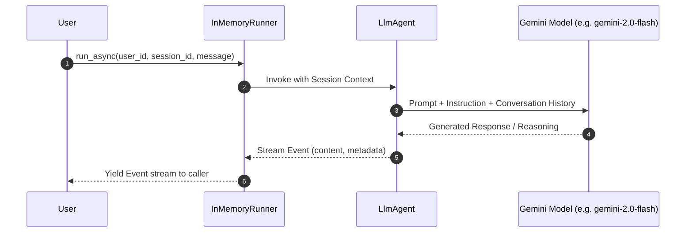

# Phase 1: Foundations of Google ADK (Agent Development Kit)

Welcome to Phase 1! In this phase, you will learn the foundational architecture of the Google Agent Development Kit (ADK) and build your first single-agent system.

---

## 📖 Key Concepts

### 1. What is Google ADK?
Google ADK is a code-first framework designed to move AI applications from simple prompt-response loops to robust, autonomous, and production-ready agents. It abstracts LLM interactions into modular, composable components:
- **`Agent` / `LlmAgent`**: The autonomous unit containing the model configuration, system instructions, and optional tools or sub-agents.
- **`Runner`**: The orchestrator and execution engine that manages the event loop, session state, and streaming responses.
- **`Event`**: The atomic unit of communication in ADK. Everything that happens (user messages, agent thoughts, model outputs, tool invocations) is streamed as an event.

### 2. The Core Architecture



### 3. Anatomies of an Agent Definition
In ADK, defining an agent is purely declarative in Python:
```python
from google.adk.agents import Agent

agent = Agent(
    name="customer_support_agent",
    model="gemini-2.0-flash",
    instruction="""
    You are a professional customer support specialist for CloudFlow SaaS.
    Your objective is to:
    1. Greet the customer professionally.
    2. Categorize the customer's request (Billing, Technical, Account).
    3. Provide accurate, empathetic guidance.
    4. Maintain a polite and helpful tone.
    """
)
```

### 4. Running the Agent: `InMemoryRunner`
ADK separates agent definition from execution. `InMemoryRunner` is ideal for development and testing:
```python
from google.adk.runners import InMemoryRunner

runner = InMemoryRunner(agent=agent, app_name="support_app")

async def chat():
    async for event in runner.run_async(
        user_id="user_123",
        session_id="session_001",
        new_message="Hi, I noticed an unexpected charge on my invoice."
    ):
        if hasattr(event, "content") and event.content:
            print(event.content)
```

---

## 🛠️ Real-World Use Case: Customer Support Triage Agent

In this phase, we implement an enterprise **Customer Support Triage & FAQ Agent** for a fictional cloud company (*CloudScale Systems*).

### What it demonstrates:
1. **System Persona & Behavioral Constraints**: Instructing the agent to act as a Tier-1 support engineer.
2. **Intent Classification**: Identifying whether the query is **Technical Support**, **Billing & Invoices**, or **Account Access**.
3. **Multi-Turn Conversation**: Retaining context across multiple turns within the same session.
4. **Structured Event Streaming**: Handling and formatting events yielded by `runner.run_async()`.

---

## 🚀 Running the Code

### 1. Run the Automated Demo
```bash
python phase_1_foundations/customer_support_agent.py
```

### 2. Run the Interactive CLI
Chat with the support agent interactively in your terminal:
```bash
python phase_1_foundations/run_interactive.py
```
