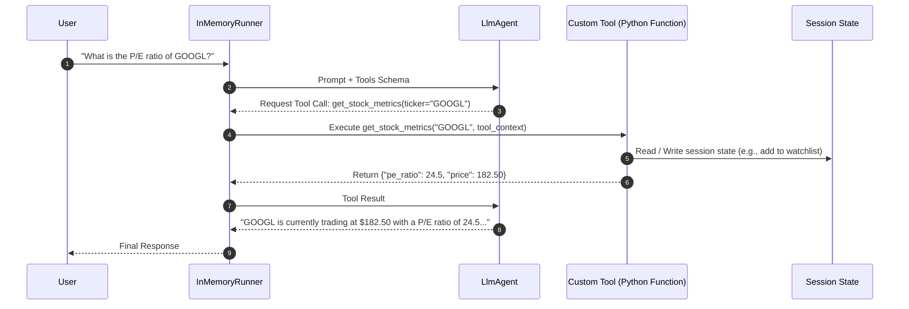

# Phase 2: Tools, Function Calling & Dynamic Actions

Welcome to Phase 2! In this phase, you will learn how to empower agents with **tools**—giving them the ability to query APIs, compute data, manipulate session state, and connect with external services via the **Model Context Protocol (MCP)**.

---

## 📖 Key Concepts

### 1. How Tools Work in Google ADK
An LLM alone cannot fetch live data or execute actions. Tools give agents "hands". In ADK:
1. **Python Function as a Tool**: You define standard Python functions with clear type hints and Google-style docstrings. ADK automatically parses them into OpenAPI/JSON schemas for the model.
2. **`tools` Parameter**: Tools are passed directly to `Agent(..., tools=[my_func, ...])`.
3. **Automatic Tool Execution Loop**: The ADK `Runner` intercepts tool call requests generated by the model, executes the Python function with the model's arguments, and passes the output back to the model to generate the final response.



### 2. The Power of `ToolContext`
Sometimes a tool needs more than just arguments—it needs access to the active session state or metadata. In ADK, if your tool function includes a parameter typed as `ToolContext`, ADK automatically injects the context at runtime without exposing it to the LLM:

```python
from google.adk.tools import ToolContext

def add_to_watchlist(ticker: str, tool_context: ToolContext) -> dict:
    """Adds a stock ticker to the user's persistent watchlist.

    Args:
        ticker: The stock symbol (e.g. AAPL, GOOGL).
        tool_context: Injected runtime context.
    """
    # Access and mutate session state directly from within the tool
    watchlist = tool_context.state.get("watchlist", [])
    if ticker.upper() not in watchlist:
        watchlist.append(ticker.upper())
        tool_context.state["watchlist"] = watchlist
        return {"status": "success", "watchlist": watchlist}
    return {"status": "already_exists", "watchlist": watchlist}
```

### 3. Built-in Tools & Model Context Protocol (MCP)
ADK supports:
- **Built-in tools**: `load_memory` retrieves saved memories when the runner has a MemoryService. Provider-specific Google Search grounding is not used with Ollama; use compatible function tools or MCP tools instead.
- **Model Context Protocol (MCP)**: Standardized open protocol by Anthropic/Google that allows connecting external servers (databases, GitHub, Slack, local file systems) as tools using `McpTool` adapters.

### 4. Tools Available with a Local LLM (Gemma + Ollama)

With this project's Gemma + Ollama setup, ADK can run model-independent tools.
Gemma requests a tool call; ADK executes it and returns the result to the model.
The model and its adapter must support tool calling; this project uses LiteLLM's
`ollama_chat` adapter.

The main options checked against ADK 2.9.2 are:

| Tool or utility | Purpose | Requirement |
|---|---|---|
| `load_memory` | Search saved conversation memories | A configured `MemoryService` with stored memories |
| `preload_memory` | Automatically insert relevant memories before model requests | A configured `MemoryService`; the model does not call this explicitly |
| `load_artifacts` | Load files previously saved as ADK artifacts | An `ArtifactService`; the content must be supported by the model |
| `exit_loop` | Stop an agent workflow loop | Used inside a `LoopAgent` |
| `transfer_to_agent` | Hand the conversation to another agent | A configured agent hierarchy |
| `AgentTool` | Let one agent call another as a tool | Another configured agent |
| `FunctionTool` | Expose Python functions as tools | Your implementation, such as `get_stock_quote` |
| `McpToolset` | Expose tools from an MCP server | A reachable MCP server, such as CoinGecko |

`FunctionTool`, `AgentTool`, and `McpToolset` are integration mechanisms: their
capabilities depend on what you connect. Individual tools and toolsets can be
registered together in an agent's `tools` list. See the
[ADK tool documentation](https://google.github.io/adk-docs/tools-custom/).

Gemini-specific built-ins do not work directly with local Gemma:

- `google_search`: Gemini's Google Search grounding.
- `url_context`: Gemini's built-in URL retrieval.
- `BuiltInCodeExecutor`: Gemini's hosted code execution.

For web search, webpage retrieval, or code execution with Gemma, provide a
compatible MCP tool or implement a Python function.

A local model does not mean every tool runs locally. In this project, Gemma
runs on the Ollama server configured in `.env`, Python stock tools run on the
computer running the agent script, and CoinGecko's MCP tools contact a remote
service. Remote tools can still require network access, credentials, or usage
limits independently of the local model.

---

## 🛠️ Real-World Use Case: Financial Market Intelligence Agent

In this phase, we build a **Financial Market Intelligence & Portfolio Agent** for equity analysts.

### Capabilities:
1. **`get_stock_quote(ticker)`**: Fetches real-time price, 52-week range, and volume.
2. **`calculate_valuation_metrics(ticker, net_income, market_cap)`**: Calculates P/E, Price-to-Book, and enterprise value.
3. **`manage_portfolio_watchlist(action, ticker, tool_context)`**: Reads and modifies the user's active watchlist stored in session state.
4. **`convert_currency(amount, from_curr, to_curr)`**: Real-time FX conversion.

---

## 🚀 Running the Code

The main agent demo uses `OLLAMA_HOST` and `OLLAMA_MODEL` from the repository-root `.env` through `llm_config.py`. No Gemini API key is required. Standalone deterministic examples do not call an LLM.

### 1. Run the Financial Research Agent
```bash
python phase_2_tools_and_actions/financial_research_agent.py
```

### 2. Explore Built-in Tools & MCP Integrations
```bash
python phase_2_tools_and_actions/mcp_and_builtin_tools.py
```

### 3. Run the Cryptocurrency Agent with CoinGecko MCP

`cryptocurrency_agent.py` uses the same Gemma model from `.env` and registers
CoinGecko's remote MCP toolset through `tools=[coingecko]`. It retrieves actual
cryptocurrency market data separately from the stock demo's sample data.

```bash
uv sync

# Default: Bitcoin and Ethereum prices in USD, with 24-hour changes
uv run python phase_2_tools_and_actions/cryptocurrency_agent.py

# Ask a different question
uv run python phase_2_tools_and_actions/cryptocurrency_agent.py "What are the top 5 coins by market cap?"

# Multi-turn chat; type exit to finish
uv run python phase_2_tools_and_actions/cryptocurrency_agent.py --interactive

# Discover the server's tools without an LLM request
uv run python phase_2_tools_and_actions/cryptocurrency_agent.py --list-tools
```

The optional `.env` setting is:

```dotenv
COINGECKO_MCP_URL=https://mcp.api.coingecko.com/mcp
```

The [public CoinGecko MCP server](https://mcp.api.coingecko.com/) requires no
API key and has shared rate limits. Tools are discovered at runtime: the
endpoint currently exposes `search_docs` and `execute`, which let the agent
look up SDK methods and retrieve data through CoinGecko's hosted execution
environment. ADK prefixes their names with `coingecko`.

This agent requires the installed MCP dependencies and network access to both
Ollama and CoinGecko. It reports connection failures instead of substituting
mock prices, and closes its MCP connection when the session ends.
