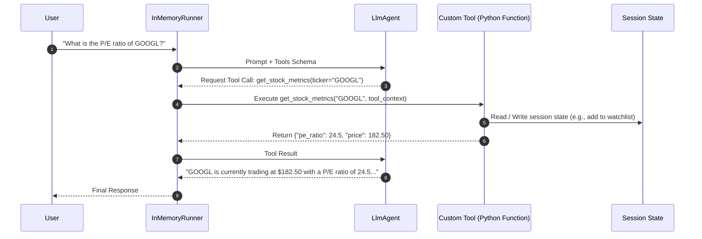

# Phase 2: Tools, Function Calling & Dynamic Actions

Welcome to Phase 2! In this phase, you will learn how to empower agents with **tools**—giving them the ability to query APIs, compute data, manipulate session state, and connect with external services via the **Model Context Protocol (MCP)**.

---

## 📖 Key Concepts

### 1. How Tools Work in Google ADK
An LLM alone cannot fetch live data or execute actions. Tools give agents "hands". In ADK:
1. **Python Function as a Tool**: You define standard Python functions with clear type hints and Google-style docstrings. ADK automatically parses them into OpenAPI/JSON schemas for the model.
2. **`tools` Parameter**: Tools are passed directly to `Agent(..., tools=[my_func, ...])`.
3. **Automatic Tool Execution Loop**: The ADK `Runner` intercepts tool call requests generated by the model, executes the Python function with the model's arguments, and passes the output back to the model to generate the final response.



### 2. The Power of `ToolContext`
Sometimes a tool needs more than just arguments—it needs access to the active session state or metadata. In ADK, if your tool function includes a parameter typed as `ToolContext`, ADK automatically injects the context at runtime without exposing it to the LLM:

```python
from google.adk.tools import ToolContext

def add_to_watchlist(ticker: str, tool_context: ToolContext) -> dict:
    """Adds a stock ticker to the user's persistent watchlist.

    Args:
        ticker: The stock symbol (e.g. AAPL, GOOGL).
        tool_context: Injected runtime context.
    """
    # Access and mutate session state directly from within the tool
    watchlist = tool_context.state.get("watchlist", [])
    if ticker.upper() not in watchlist:
        watchlist.append(ticker.upper())
        tool_context.state["watchlist"] = watchlist
        return {"status": "success", "watchlist": watchlist}
    return {"status": "already_exists", "watchlist": watchlist}
```

### 3. Built-in Tools & Model Context Protocol (MCP)
ADK supports:
- **Built-in tools**: `google_search` for live web grounding, `code_interpreter` for sandboxed Python code execution.
- **Model Context Protocol (MCP)**: Standardized open protocol by Anthropic/Google that allows connecting external servers (databases, GitHub, Slack, local file systems) as tools using `McpTool` adapters.

---

## 🛠️ Real-World Use Case: Financial Market Intelligence Agent

In this phase, we build a **Financial Market Intelligence & Portfolio Agent** for equity analysts.

### Capabilities:
1. **`get_stock_quote(ticker)`**: Fetches real-time price, 52-week range, and volume.
2. **`calculate_valuation_metrics(ticker, net_income, market_cap)`**: Calculates P/E, Price-to-Book, and enterprise value.
3. **`manage_portfolio_watchlist(action, ticker, tool_context)`**: Reads and modifies the user's active watchlist stored in session state.
4. **`convert_currency(amount, from_curr, to_curr)`**: Real-time FX conversion.

---

## 🚀 Running the Code

### 1. Run the Financial Research Agent
```bash
python phase_2_tools_and_actions/financial_research_agent.py
```

### 2. Explore Built-in Tools & MCP Integrations
```bash
python phase_2_tools_and_actions/mcp_and_builtin_tools.py
```
