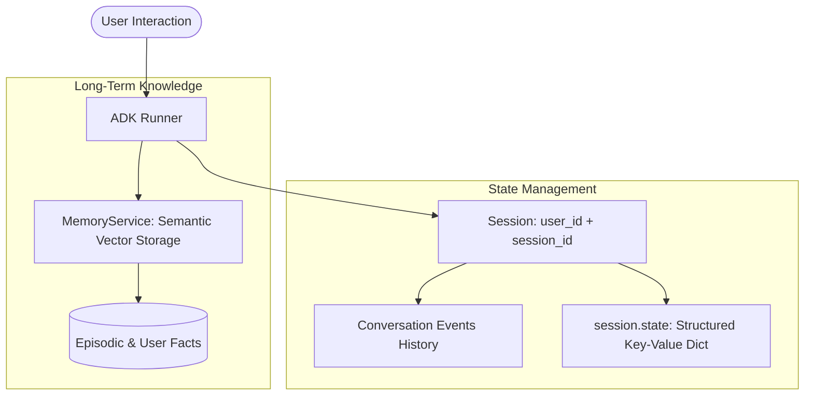

# Phase 3: Sessions, State Management & Memory Persistence

Welcome to Phase 3! In this phase, you will master how Google ADK handles conversational state, session persistence, and long-term semantic memory.

---

## 📖 Key Concepts

### 1. The Three Layers of Agent Memory

Understanding how agents retain context is critical for building enterprise-grade applications:

| Memory Layer | Storage Mechanism | Scope & Lifetime | Example |
|---|---|---|---|
| **1. Conversation History** | `session.events` | Current session / thread | "In your previous message, you said..." |
| **2. Session State** | `session.state` (Key-Value) | Current session (ephemeral or DB) | Active cart, calculated calorie deficit, user profile |
| **3. Long-Term Memory** | `MemoryService` (Vector DB) | Cross-session, persistent | "The user has a knee injury and prefers low-impact cardio." |



### 2. The `SessionService` Architecture
In ADK, state persistence is abstracted through `SessionService`:
- **`InMemorySessionService`**: Stores state in Python memory. Ideal for testing and local development.
- **`VertexAiSessionService`**: Backed by Google Cloud Vertex AI managed infrastructure.
- **Custom Database Services**: Easily connect Redis, Cloud SQL (PostgreSQL), or Firestore by implementing the `SessionService` interface (`get_session`, `create_session`, `update_session`).

### 3. Mutating `session.state`
Agents and tools interact with session state seamlessly:
```python
# Reading state
user_goal = session.state.get("target_weight_kg", 70)

# Mutating state
session.state["daily_calories_consumed"] = session.state.get("daily_calories_consumed", 0) + 450
```

### 4. `MemoryService`: Semantic Cross-Session Recall
While `session.state` resets or expires per conversation session, `MemoryService` persists across weeks or months. When a user begins a brand new session, the agent can query `MemoryService` using vector similarity search to recall facts established in previous conversations.

---

## 🛠️ Real-World Use Case: Health & Wellness Coach Agent

In this phase, we build a **Personalized Health & Wellness Coach Agent** (*FitPulse*).

### What it demonstrates:
1. **Dynamic Session State**: Logging meals, tracking remaining daily calorie budget, and recording completed workouts.
2. **Session Persistence**: Maintaining the user's metabolic profile across multi-turn interactions.
3. **Cross-Session Memory Recall**: Recalling past health conditions (e.g., knee surgery, gluten intolerance) in a completely new session using `MemoryService`.

---

## 🚀 Running the Code

The main agent demo uses `OLLAMA_HOST` and `OLLAMA_MODEL` from the repository-root `.env` through `llm_config.py`. No Gemini API key is required. Standalone deterministic examples do not call an LLM.

### 1. Run the Wellness Coach Agent (Session State)
```bash
python phase_3_sessions_and_memory/wellness_coach_agent.py
```

### 2. Run the Memory Service Semantic Recall Demo
```bash
python phase_3_sessions_and_memory/memory_service_demo.py
```
