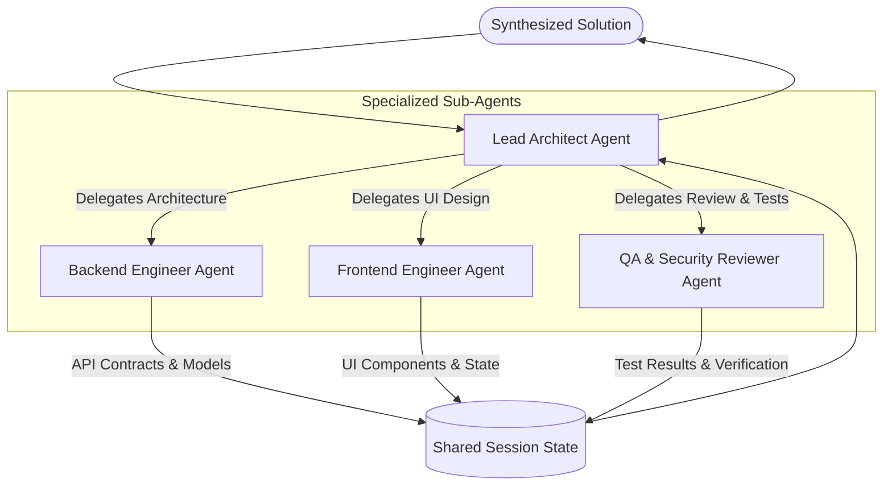

# Phase 4: Multi-Agent Orchestration & Task Delegation

Welcome to Phase 4! In this phase, you will master **Multi-Agent Systems (MAS)** in Google ADK—composing specialized agents into collaborating teams and hierarchical organizations.

---

## 📖 Key Concepts

### 1. Why Multi-Agent Systems?
When a single agent tries to do everything (writing code, designing UI, security analysis, database queries), it suffers from:
- **Prompt Contamination**: Instructions become too long, conflicting, and diluted.
- **Tool Clutter**: Giving 30+ tools to one LLM causes high tool-selection error rates.
- **Context Exhaustion**: Long trajectories fill the model's context window rapidly.

**Solution**: Divide responsibilities into specialized agents (e.g. Architect, Backend, Frontend, QA) coordinated by a Lead Agent.

---

### 2. Multi-Agent Topologies in Google ADK



---

### 3. Two Delegation Mechanisms in ADK

#### A. The `sub_agents` Hierarchy
You pass specialized agents directly to the parent's `sub_agents` argument. The parent model reads each sub-agent's description and instruction to decide when and to whom to route the task:
```python
from google.adk.agents import Agent

backend_agent = Agent(
    name="backend_engineer",
    instruction="You specialize in Python, FastAPI, and database schemas."
)

frontend_agent = Agent(
    name="frontend_engineer",
    instruction="You specialize in React, TypeScript, and Tailwind CSS."
)

lead_agent = Agent(
    name="lead_architect",
    model="gemini-2.0-flash",
    instruction="Coordinate user feature requests across backend and frontend engineers.",
    sub_agents=[backend_agent, frontend_agent]
)
```

#### B. Agents as Tools (`AgentTool`)
You can wrap an agent as an explicit tool using `AgentTool(agent=...)`. This allows the parent agent to invoke the sub-agent as a callable function with structured arguments.

---

### 4. Shared State Across Agents
All agents within an ADK hierarchy share the same session context (`session.state`). If the Backend Engineer writes an API spec to `session.state["api_spec"]`, the Frontend Engineer can immediately access it to generate matching UI code.

---

## 🛠️ Real-World Use Case: Autonomous Software Engineering Team

In this phase, we build an **Autonomous Software Engineering Team** consisting of:
1. **Lead Architect Agent**: Analyzes user product requirements, produces a technical blueprint, and delegates tasks.
2. **Backend Developer Agent**: Generates data models and RESTful API endpoints.
3. **Frontend Developer Agent**: Builds responsive UI components consuming the backend endpoints.
4. **QA & Code Reviewer Agent**: Validates the code, generates unit tests, and conducts security checks.

---

## 🚀 Running the Code

### 1. Run the Multi-Agent Software Team
```bash
python phase_4_multi_agent_orchestration/software_team_agents.py
```

### 2. Explore Hierarchical Delegation & State Handoffs
```bash
python phase_4_multi_agent_orchestration/hierarchical_delegation.py
```
