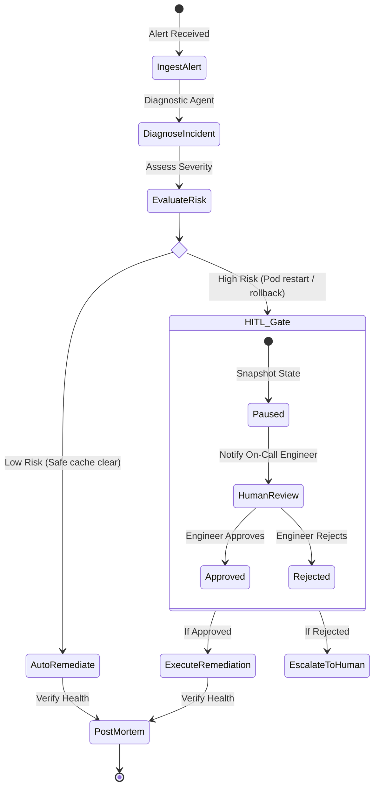

# Phase 5: Workflows, Graph-Based Orchestration & Human-in-the-Loop (HITL)

Welcome to Phase 5! In this phase, you will explore **ADK Workflows**—the graph-based execution engine that provides deterministic orchestration, loops, branching, and Human-in-the-Loop (HITL) approval gates.

---

## 📖 Key Concepts

### 1. The Need for Graph-Based Workflows
While autonomous LLM agents are great for open-ended exploration, enterprise systems require **predictability, auditability, and guardrails**:
- An agent should not loop indefinitely when encountering an error.
- Sensitive or destructive actions (restarting servers, issuing large refunds, dropping tables) must never execute autonomously without human sign-off.
- Multi-step business processes must follow strict conditional paths.

Google ADK introduces a **graph-based workflow runtime** that enables a "Spectrum of Control"—combining deterministic code graphs with autonomous LLM reasoning nodes.

---

### 2. Workflow Anatomy



---

### 3. Human-in-the-Loop (HITL) Architecture

HITL in ADK allows a workflow to **pause**, serialize its complete execution state to storage, and exit the event loop. Once a human operator approves or rejects the action via a web UI, Slack, or CLI, the runner **resumes** execution from the exact paused node:

1. **Gate Evaluation**: The workflow identifies a sensitive action.
2. **State Snapshot**: Current node, context, and proposed plan are saved to `session.state["pending_approval"]`.
3. **Execution Suspended**: The runner returns a `PAUSED_FOR_INPUT` status event.
4. **Resumption**: The human submits approval (or modification). The runner restores the session and continues to the downstream nodes.

---

## 🛠️ Real-World Use Case: Enterprise Incident Auto-Remediation Pipeline

In this phase, we build an **Enterprise Site Reliability Engineering (SRE) Incident Remediation Pipeline** for cloud infrastructure.

### Stages:
1. **Alert Ingestion**: Ingests high-memory alert from Kubernetes cluster.
2. **Diagnostic Analysis**: LLM agent inspects logs and identifies memory leak in container `billing-service-v2.1`.
3. **Remediation Plan Formulation**: Formulates remediation (rolling restart of affected pods).
4. **HITL Authorization Gate**: Flags action as **HIGH RISK**, pauses execution, and requests operator sign-off.
5. **Remediation & Health Check**: Upon operator approval, executes restart and verifies telemetry.
6. **Post-Mortem Generation**: Synthesizes a root-cause analysis (RCA) report.

---

## 🚀 Running the Code

### 1. Run the Full Incident Remediation Workflow
```bash
python phase_5_workflows_and_hitl/incident_remediation_workflow.py
```

### 2. Test the Interactive Human-in-the-Loop (HITL) Gate
```bash
python phase_5_workflows_and_hitl/human_in_the_loop_gate.py
```
