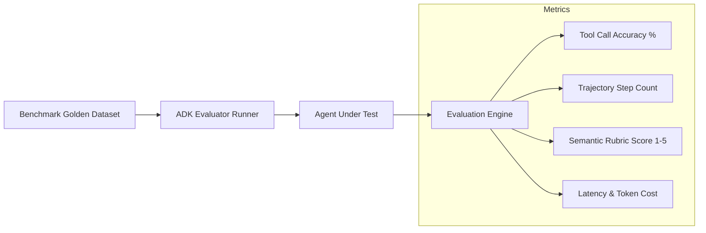

# Phase 6: Evaluation, Observability & Production Deployment

Welcome to Phase 6! In this final phase, you will learn how to **evaluate**, **monitor**, and **deploy** Google ADK agents to production infrastructure with enterprise-grade reliability.

---

## 📖 Key Concepts

### 1. Agent Evaluation Framework
Evaluating generative AI agents requires moving beyond simple string equality:
- **Trajectory Evaluation**: Did the agent invoke the right sequence of tools?
- **Tool Call Accuracy**: Were the tool arguments formatted correctly and within schema?
- **Response Quality (LLM-as-a-Judge)**: Rubric-based scoring for accuracy, helpfulness, and safety.
- **Latency & Token Efficiency**: Monitoring token consumption and execution time per turn.



---

### 2. Observability & Telemetry
In production, you cannot treat an agent as a black box. ADK provides deep observability:
- **Event Streaming**: Every thought, tool call, error, and response is yielded as a structured `Event`.
- **OpenTelemetry & Monocle**: Automatic instrumentation that captures spans for each LLM generation, tool execution, and session state mutation.
- **`adk web`**: A built-in local development server (`adk web`) allowing you to inspect live agent runs, test conversational inputs, and visualize execution graphs in your browser.

---

### 3. Production Deployment Options

Google ADK agents are container-native and deployment-agnostic:

| Deployment Target | Best For | Key Benefits |
|---|---|---|
| **Google Cloud Run** | Serverless microservices | Autoscaling to zero, pay-per-request, custom Docker containers |
| **Vertex AI Agent Builder** | Google Cloud native agents | Integrated enterprise search, managed security & IAM, Google console UI |
| **Kubernetes (GKE)** | High-throughput, private clusters | Custom VPC networking, dedicated GPU/TPU nodes, strict compliance |

---

## 🛠️ Real-World Use Case: Enterprise Legal Contract Compliance Auditor

In this phase, we build and deploy an **Enterprise Contract Compliance Auditor** that verifies non-disclosure agreements (NDAs) and vendor contracts against corporate legal guidelines.

### What it demonstrates:
1. **Automated Evaluation Benchmark**: Running 3 golden test cases (valid NDA, missing jurisdiction clause, excessive liability) and scoring agent performance.
2. **Telemetry & Tracing**: Measuring latency, tool call accuracy, and token efficiency.
3. **Containerization & Cloud Deployment**: Complete `Dockerfile` and `deploy_cloud_run.sh` script.

---

## 🚀 Running the Code

The main agent demo uses `OLLAMA_HOST` and `OLLAMA_MODEL` from the repository-root `.env` through `llm_config.py`. No Gemini API key is required. Standalone deterministic examples do not call an LLM.

### 1. Run the Evaluation Benchmark Suite
```bash
python phase_6_eval_observability_deployment/eval_suite.py
```

### 2. Run Telemetry & Event Tracing
```bash
python phase_6_eval_observability_deployment/telemetry_and_monitoring.py
```

### 3. Build & Deploy Container
```bash
# Build Docker image
docker build -f phase_6_eval_observability_deployment/Dockerfile -t gcr.io/my-project/adk-contract-agent:v1 .

# Review deployment script
cat phase_6_eval_observability_deployment/deploy_cloud_run.sh
```
